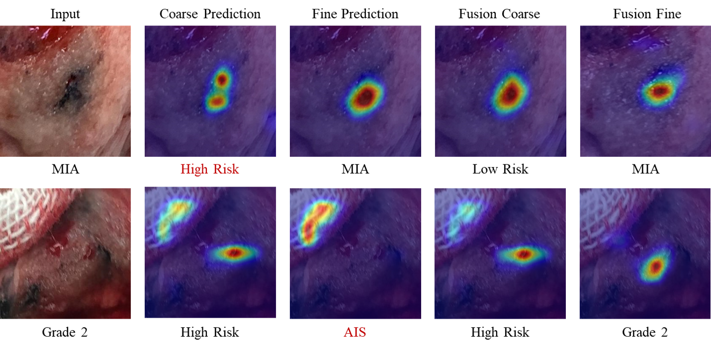

# SuRImage: Deep learning model for pathological invasiveness prediction based on surgical resection images
The official implementation of [SuRImage](https://ascopubs.org/doi/abs/10.1200/JCO.2024.42.16_suppl.1563) (Pending).
## 1. Introduction
### 1.1 Background
Intraoperative diagnosis is crucial for selecting segmentectomy or lobectomy in clinical stage IA lung adenocarcinoma (LUAD). Current pathological examination during surgery suffers from chanllenges:

(i) The long time for frozen section analysis.

(ii) The ambiguous and inaccurate report through patholigcal examination.

To overcome these issues, we propose a novel framework named SuRImage that assits intraoperative diagnosis based on surgical resection images, provides providing insights into the macroscopic morphological features that indicate LUAD pathological invasiveness.

### 1.2. Framework
The main novelty of SuRImage is shown in subsequent Figure 1. Motivated by [Fine-Grained Learning](https://openaccess.thecvf.com/content_cvpr_2017/html/Fu_Look_Closer_to_CVPR_2017_paper.html), we propose a coarse-to-fine grained classification model for completing three tasks in assisting LUAD diagnosis, namely, IAC diagnosis, IAC identification, and IAC classification.
<p align="center">
     <br />
    <em> 
    Figure 1. Overview of the Coarse-to-fine framework in SuRImage.
    </em>
</p>

## 2. Quick Start
### 2.1 Installation
Assuming that you have installed PyTorch and TorchVision, if not, please follow the [officiall instruction](https://pytorch.org/) to install them firstly. 
Intall the dependencies using cmd:
``` sh
python -m pip install -r requirements.txt --user -q
```
The code is developed and tested using pytorch 1.12.1 + cu113. Other versions of pytorch are not fully tested.
### 2.2 Data preparation
Data are saved at Datasets. Please prepare the data as following:
``` sh
|-Datasets
  |-GDHP
    |-AIS
    | |-img1.png
    | |-img2.png
    | | |-...
    |-MIA
    | |-img3.png
    | |-img4.png
    | | |-...
    |-1
    | |-img5.png
    | |-img6.png
    | | |-...
    |-2
    | |-img7.png
    | |-img8.png
    | | |-...
    |-3
    | |-img9.png
    | |-img10.png
    | | |-...
```
Data split script and patient information could be refered by the provided files.
### 2.3 Pretrained Weights
[Pretrained weights](https://huggingface.co/) are saved at "./pretrained_weights/", which could accelerate the training convergence.
``` sh
|-pretrained_weights
| |-resnext50_32x4.bin
| |-seresnext50_32x4d.bin
| |-...
```
Surely, you can also train the backbone yourself.
### 2.4 Training
Training your SuRImage:
``` sh
python trainer_vanilla.py
python trainer_fusion.py
python trainer_clinic.py # SuRImage
```
### 2.5 Testing
Testing your SuRImage:
``` sh
python tester_vanilla.py
python tester_fusion.py
python tester_clinic.py # SuRImage
```
Evaluation procedures are also offered, like class activation map generation (generate_cam.py), ROC drawing (draw_roc_xxx.py), confusion matrix drawing (draw_confusion_matrix.py), etc.
SuRImage achieves the encouraging performance on three tasks, improving the diagnosis efficency and uncovering the pathological attributes contained in resection images:
<p align="center">
     <br />
    <em> 
    Figure 2. Class activation maps generated by SuRImage.
    </em>
</p>

## 3. Citation (will be updated soon)
If you find this work or code is helpful in your research, please cite:

```
@misc{yao2024adaptively,
  title={Adaptively learning visual model of surgical resection images via coarse-to-fine--grained strategy for pathological invasiveness prediction in indeterminate stage IA lung adenocarcinoma.},
  author={Yao, Lintong and Zhou, HaiYu and Cai, Linghan and Li, Qiaxuan and Xie, Daipeng and Lin, Hongwei},
  year={2024},
  publisher={American Society of Clinical Oncology}
}

@article{cai2024know,
  title={Know your orientation: A viewpoint-aware framework for polyp segmentation},
  author={Cai, Linghan and Chen, Lijiang and Huang, Jianhao and Wang, Yifeng and Zhang, Yongbing},
  journal={Medical Image Analysis},
  volume={97},
  pages={103288},
  year={2024},
  publisher={Elsevier}
}
```

## 4. Contributing
Thanks to the following work for improving our project：
- torch-cam: [https://github.com/frgfm/torch-cam](https://github.com/frgfm/torch-cam)
- RANet: [https://github.com/jeong-tae/RACNN-pytorch](https://github.com/jeong-tae/RACNN-pytorch)
- VANet: [https://github.com/1024803482/Viewpoint-Aware-Network](VANet)
- albumentations: [https://github.com/albumentations-team/albumentations](albumentations)

## 5. License
Distributed under the Apache 2.0 License. See LICENSE for more information.
